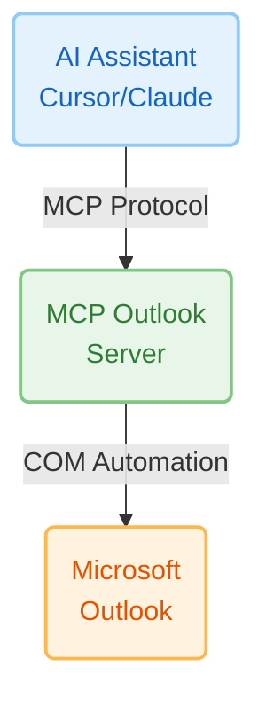

# Complete Documentation - MCP Outlook

Complete technical documentation for MCP Outlook v1.0.2

## Table of Contents

- [Architecture](#architecture)
- [Installation](#installation)
- [Configuration](#configuration)
-  [Email Tools](#email-tools)
-  [Calendar Tools](#calendar-tools)
-  [Contact Tools](#contact-tools)
-  [Folder Tools](#folder-tools)
- [Error Handling](#error-handling)
- [Performance](#performance)
- [Security](#security)
- [Limitations](#limitations)

---

## Architecture

### Overview

MCP Outlook is an MCP (Model Context Protocol) server that allows AI assistants to interact with Microsoft Outlook via the Windows COM API.



### Technologies

- **Python 3.10+** - Base language
- **FastMCP** - MCP Framework
- **pywin32** - COM automation
- **dateutil** - Flexible date parsing

### Project Structure

```
mcp-outlook/
├── src/
│   ├── __init__.py
│   └── outlook_mcp.py      # Main MCP server (1840 lines)
├── tests/
│   ├── __init__.py
│   ├── test_connection.py
│   ├── test_outlook_mcp.py
│   ├── test_advanced.py
│   └── test_tools.py
├── pyproject.toml          # Project configuration
├── requirements.txt        # Dependencies
├── README.md              # User documentation
├── DOCUMENTATION.md       # This file
├── CONTRIBUTING.md        # Contribution guide
├── CHANGELOG.md           # Version history
├── LICENSE                # MIT License
├── QUICK_START.md         # Quick start guide
└── EXAMPLES.md            # Usage examples
```

---

## Installation

### Prerequisites

#### Operating System
- **Windows 10/11** (required for COM automation)
- Not possible on Linux/macOS (Windows COM API only)

#### Software
- **Microsoft Outlook** (version 2010+)
  - Installed and configured
  - At least one email account configured
  - Outlook must be running

#### Python
- **Python 3.10 or higher**
- Check: `python --version`
- Download: https://www.python.org/downloads/

### Installing Dependencies

```bash
# Clone/download the project
git clone https://github.com/YOUR_USERNAME/mcp-outlook.git
cd mcp-outlook

# Install dependencies
pip install -r requirements.txt

# OR install in development mode
pip install -e .
```

### Python Dependencies

The `requirements.txt` file contains:

```txt
fastmcp>=0.1.0
pywin32>=306
python-dateutil>=2.8.2
```

#### Dependency Details

- **fastmcp** - MCP framework for creating servers
- **pywin32** - Access to Windows COM APIs
- **python-dateutil** - Flexible date parsing

### Post-Installation pywin32

If you encounter errors with `win32com`, run:

```bash
python Scripts/pywin32_postinstall.py -install
```

### Installation Verification

```bash
python tests/test_connection.py
```

Expected output:
```
✓ PASS: Imports
✓ PASS: Outlook Connection
✓ PASS: Server File
```

---

## Configuration

### MCP Configuration

#### For Cursor

File: `~/.cursor/mcp.json` or workspace settings

```json
{
  "mcpServers": {
    "outlook": {
      "command": "python",
      "args": [
        "C:/Users/YOUR_USERNAME/path/to/mcp-outlook/src/outlook_mcp.py"
      ],
      "env": {}
    }
  }
}
```

#### For Claude Desktop

File: `%APPDATA%/Claude/claude_desktop_config.json`

```json
{
  "mcpServers": {
    "outlook": {
      "command": "python",
      "args": [
        "C:/Users/YOUR_USERNAME/path/to/mcp-outlook/src/outlook_mcp.py"
      ]
    }
  }
}
```

### Configuration Variables

In `src/outlook_mcp.py`:

```python
# Default limits
DEFAULT_EMAIL_LIMIT = 5        # Default email limit returned
MAX_EMAIL_LIMIT = 50           # Maximum allowed limit
DEFAULT_CONTACT_LIMIT = 50     # Default contact limit
MAX_CONTACT_LIMIT = 200        # Maximum contact limit
EMAIL_BODY_PREVIEW_LENGTH = 500  # Body preview length
DEFAULT_DAYS_BACK = 2          # Search last 2 days by default

# Excluded stores (team/shared mailboxes)
EXCLUDED_STORES = [
    # Example: "Team Mailbox Name",
]
```

### Logging

Logging is configured in silent mode by default:

```python
# CRITICAL level only (no spam)
logging.basicConfig(
    level=logging.CRITICAL,
    format='%(message)s',
    handlers=[logging.NullHandler()]
)
```

To enable debugging, modify in `outlook_mcp.py`:

```python
logger.setLevel(logging.DEBUG)  # Instead of CRITICAL
```

---

##  Email Tools

### `get_inbox_emails`

Retrieves emails from the inbox.

#### Parameters

| Parameter | Type | Default | Description |
|-----------|------|---------|-------------|
| `limit` | int | 5 | Max number of emails to return |
| `unread_only` | bool | False | Return only unread emails |

#### Return

```json
{
  "success": true,
  "count": 3,
  "emails": [
    {
      "subject": "Q1 Budget Review",
      "sender": "Jane Smith",
      "sender_email": "jane.smith@company.com",
      "recipients": "team@company.com",
      "cc": "",
      "bcc": "",
      "received_time": "2025-12-17 09:30:00+00:00",
      "sent_on": "2025-12-17 09:29:45+00:00",
      "body": "Hi team, please review...",
      "body_length": 1245,
      "has_attachments": true,
      "attachment_count": 2,
      "attachments": [
        {
          "filename": "report.pdf",
          "size": 245678,
          "type": 1
        }
      ],
      "importance": 1,
      "unread": true,
      "categories": "",
      "entry_id": "00000000..."
    }
  ]
}
```

#### Example

```python
# Last 10 unread emails
get_inbox_emails(limit=10, unread_only=True)

# Last 5 emails (read and unread)
get_inbox_emails(limit=5)
```

#### Notes

- Limited to `MAX_EMAIL_LIMIT` (50) to avoid Outlook freezes
- Body is truncated to `EMAIL_BODY_PREVIEW_LENGTH` (500 characters)
- Emails are sorted by received date descending

---

### `get_sent_emails`

Retrieves sent emails.

#### Parameters

| Parameter | Type | Default | Description |
|-----------|------|---------|-------------|
| `limit` | int | 5 | Max number of emails to return |

#### Return

Same format as `get_inbox_emails`.

#### Example

```python
get_sent_emails(limit=10)
```

---

### `search_emails`

Searches emails in standard folders.

#### Parameters

| Parameter | Type | Default | Description |
|-----------|------|---------|-------------|
| `query` | str | *required* | Search term |
| `folder` | str | "inbox" | Folder ("inbox", "sent", "drafts", "deleted", "all") |
| `limit` | int | 20 | Max number of results |

#### Return

```json
{
  "success": true,
  "query": "project alpha",
  "count": 5,
  "emails": [...]
}
```

#### Example

```python
# Search in inbox
search_emails(query="meeting", folder="inbox", limit=10)

# Search everywhere
search_emails(query="budget", folder="all", limit=50)
```

#### Notes

- Searches in subject, body, and sender
- Uses Outlook's DASL syntax for efficiency
- folder="all" searches in inbox, sent, and drafts

---

### `send_email`

Sends an email via Outlook.

#### Parameters

| Parameter | Type | Default | Description |
|-----------|------|---------|-------------|
| `to` | str | *required* | Recipient(s), separated by ";" |
| `subject` | str | *required* | Email subject |
| `body` | str | *required* | Content (plain text) |
| `cc` | str | None | CC recipients |
| `bcc` | str | None | BCC recipients |
| `importance` | str | "normal" | "low", "normal" or "high" |
| `html_body` | str | None | HTML content (takes precedence over body) |
| `signature_name` | str | None | Outlook signature name |

#### Return

```json
{
  "success": true,
  "message": "Email sent to colleague@company.com"
}
```

#### Examples

```python
# Simple email
send_email(
    to="colleague@company.com",
    subject="Meeting Follow-up",
    body="Thanks for the meeting today.",
    importance="normal"
)

# Email with CC and high importance
send_email(
    to="team@company.com",
    subject="Urgent: Server Down",
    body="The production server is down.",
    cc="manager@company.com",
    importance="high"
)

# HTML email with signature
send_email(
    to="client@example.com",
    subject="Project Update",
    html_body="<h1>Update</h1><p>The project is on track.</p>",
    signature_name="VP DXT"
)
```

#### Notes on Signatures

- If `signature_name` is provided, Outlook automatically adds the signature
- Signature is inserted via `Display(False)` to preserve images
- Outlook adds ~2 blank lines before signature (native behavior)
- Signatures are searched in `%APPDATA%\Microsoft\Signatures`

---

### `create_draft_email`

Creates a draft email without sending.

#### Parameters

Same as `send_email` (except no `importance`).

#### Return

```json
{
  "success": true,
  "message": "Draft email created"
}
```

#### Example

```python
create_draft_email(
    to="team@company.com",
    subject="Weekly Report",
    body="Please review before sending.",
    cc="manager@company.com",
    signature_name="VP DXT"
)
```

#### Notes

- Draft is saved in the Drafts folder
- Can be modified and sent manually from Outlook

---

##  Calendar Tools

### `get_calendar_events`

Retrieves calendar events.

#### Parameters

| Parameter | Type | Default | Description |
|-----------|------|---------|-------------|
| `days_ahead` | int | 7 | Number of days ahead |
| `include_past` | bool | False | Include past events from today |

#### Return

```json
{
  "success": true,
  "count": 3,
  "events": [
    {
      "subject": "Team Standup",
      "start": "2025-12-17 09:00:00",
      "end": "2025-12-17 09:30:00",
      "location": "Conference Room A",
      "organizer": "manager@company.com",
      "required_attendees": "team@company.com",
      "optional_attendees": "",
      "body": "Daily standup meeting",
      "is_all_day_event": false,
      "reminder_set": true,
      "reminder_minutes": 15,
      "categories": "",
      "busy_status": 2
    }
  ]
}
```

#### Busy Status

- `0` - Free
- `1` - Tentative
- `2` - Busy
- `3` - Out of Office

#### Example

```python
# Events for next 7 days
get_calendar_events(days_ahead=7)

# Events for today (including past)
get_calendar_events(days_ahead=0, include_past=True)
```

---

### `create_calendar_event`

Creates a new calendar event.

#### Parameters

| Parameter | Type | Default | Description |
|-----------|------|---------|-------------|
| `subject` | str | *required* | Event title |
| `start_time` | str | *required* | Start date/time |
| `end_time` | str | *required* | End date/time |
| `location` | str | None | Location |
| `body` | str | None | Description |
| `required_attendees` | str | None | Required attendees, separated by ";" |
| `optional_attendees` | str | None | Optional attendees |
| `reminder_minutes` | int | 15 | Minutes before reminder |
| `is_all_day` | bool | False | All-day event |

#### Supported Date Formats

- ISO: `"2025-12-20 14:00"`
- Natural language: `"tomorrow 2pm"`, `"next Monday at 9am"`

#### Return

```json
{
  "success": true,
  "message": "Calendar event 'Team Meeting' created for 2025-12-20 14:00"
}
```

#### Example

```python
create_calendar_event(
    subject="Sprint Planning",
    start_time="2025-12-20 14:00",
    end_time="2025-12-20 15:30",
    location="Conference Room B",
    body="Planning for next sprint",
    required_attendees="team@company.com",
    reminder_minutes=30
)
```

#### Notes

- If attendees are specified, an invitation is sent automatically
- Date parsing uses `python-dateutil` for flexibility

---

### `search_calendar_events`

Searches events by keyword.

#### Parameters

| Parameter | Type | Default | Description |
|-----------|------|---------|-------------|
| `query` | str | *required* | Search term |
| `days_range` | int | 30 | Days to search (past and future) |

#### Example

```python
# Search "standup" in last 30 and next 30 days
search_calendar_events(query="standup", days_range=30)

# Search "Conference Room A" in the week
search_calendar_events(query="Conference Room A", days_range=7)
```

#### Notes

- Searches in subject AND location
- Case-insensitive search

---

##  Contact Tools

### `get_contacts`

Retrieves contacts.

#### Parameters

| Parameter | Type | Default | Description |
|-----------|------|---------|-------------|
| `limit` | int | 50 | Max number of contacts |
| `search_name` | str | None | Filter by name |

#### Return

```json
{
  "success": true,
  "count": 3,
  "contacts": [
    {
      "full_name": "Jane Smith",
      "email1": "jane.smith@company.com",
      "email2": "",
      "email3": "",
      "company": "Acme Corp",
      "job_title": "Product Manager",
      "business_phone": "+1-555-1234",
      "mobile_phone": "+1-555-5678",
      "home_phone": "",
      "business_address": "123 Main St",
      "categories": ""
    }
  ]
}
```

#### Example

```python
# All contacts
get_contacts(limit=50)

# Search "Smith"
get_contacts(limit=20, search_name="Smith")
```

---

### `create_contact`

Creates a new contact.

#### Parameters

| Parameter | Type | Default | Description |
|-----------|------|---------|-------------|
| `full_name` | str | *required* | Full name |
| `email` | str | *required* | Primary email |
| `company` | str | None | Company |
| `job_title` | str | None | Job title |
| `business_phone` | str | None | Business phone |
| `mobile_phone` | str | None | Mobile |
| `home_phone` | str | None | Home phone |

#### Example

```python
create_contact(
    full_name="John Doe",
    email="john.doe@techcorp.com",
    company="TechCorp",
    job_title="Senior Engineer",
    business_phone="+1-555-1234"
)
```

---

### `search_contacts`

Searches contacts.

#### Parameters

| Parameter | Type | Default | Description |
|-----------|------|---------|-------------|
| `query` | str | *required* | Search term |

#### Example

```python
# Search by name
search_contacts(query="John Smith")

# Search by email
search_contacts(query="@acmecorp.com")

# Search by company
search_contacts(query="Acme Corp")
```

#### Notes

- Searches in name, email AND company
- Case-insensitive
- No limit (all matching contacts)

---

##  Folder Tools

### `list_outlook_folders`

Lists all Outlook folders.

#### Return

```json
{
  "success": true,
  "count": 25,
  "folders": [
    {
      "name": "Inbox",
      "path": "Inbox"
    },
    {
      "name": "Archive",
      "path": "Inbox/Archive"
    },
    {
      "name": "Personal",
      "path": "Personal"
    },
    {
      "name": "My Mails",
      "path": "Personal/My Mails"
    }
  ]
}
```

#### Example

```python
list_outlook_folders()
```

#### Notes

- **Ultra-fast**: Does NOT include item counts (avoids freezes)
- Includes all folders recursively
- Skips inaccessible system folders

---

### `search_emails_in_custom_folder`

Searches emails in a custom folder.

#### Parameters

| Parameter | Type | Default | Description |
|-----------|------|---------|-------------|
| `folder_path` | str | *required* | Folder path |
| `query` | str | None | Search term (optional) |
| `limit` | int | 20 | Max number of results |
| `days_back` | int | 2 | Days back to search |
| `recursive` | bool | True | Search in subfolders |

#### Return

```json
{
  "success": true,
  "folder": "Personal/My Mails",
  "query": "invoice",
  "count": 5,
  "days_back": 2,
  "info": "Searched emails from last 2 days only",
  "emails": [...]
}
```

#### Examples

```python
# Search in "Personal/My Mails" (last 2 days)
search_emails_in_custom_folder(
    folder_path="Personal/My Mails"
)

# Search with query and more days
search_emails_in_custom_folder(
    folder_path="Personal/My Mails",
    query="invoice",
    days_back=30,
    limit=50
)

# WARNING: Search ALL emails (can freeze Outlook!)
search_emails_in_custom_folder(
    folder_path="Personal/My Mails",
    days_back=0  # 0 = all emails
)
```

#### Notes

- **IMPORTANT**: `days_back=2` by default to avoid freezes
- **NEW**: `recursive=True` by default to search in all subfolders automatically
- `days_back=0` or negative searches ALL emails (very slow)
- Use `list_outlook_folders()` to find paths
- Set `recursive=False` to search only in the specified folder
- Path is case-sensitive

---

## Error Handling

### Standard Format

All tools return a consistent error format:

```json
{
  "success": false,
  "error": "Error description"
}
```

### Common Errors

#### Outlook not accessible

```json
{
  "success": false,
  "error": "Unable to connect to Outlook. Make sure Outlook is installed and properly configured."
}
```

**Solutions**:
- Check that Outlook is running
- Check that an account is configured
- Restart Outlook
- Run as administrator

#### Folder not found

```json
{
  "success": false,
  "error": "Folder 'Custom/Path' not found. Use list_outlook_folders() to see available folders."
}
```

**Solutions**:
- Use `list_outlook_folders()` to see paths
- Check path case
- Check that folder exists

#### Invalid EntryID

```json
{
  "success": false,
  "error": "Failed to get item from EntryID"
}
```

**Solutions**:
- Check that EntryID is valid
- Email may have been deleted

#### File not found

```json
{
  "success": false,
  "error": "Attachment file not found or couldn't be attached: C:/file.pdf"
}
```

**Solutions**:
- Check file path
- Use absolute path
- Check permissions

#### Feature not available

```json
{
  "success": false,
  "error": "Out-of-Office settings not accessible via COM automation on this Outlook version."
}
```

**Solutions**:
- Feature requires Outlook 2010+ with Exchange
- Use Outlook interface directly
- Check Outlook version

---

## Performance

### Implemented Optimizations

#### 1. Folder Cache

```python
_FOLDER_CACHE: Dict[str, Any] = {}
```

- Caches resolved folder objects
- **Gain**: 45x faster on repeated searches
- First search: ~45s
- Subsequent searches: ~1s

#### 2. Date Filter

```python
DEFAULT_DAYS_BACK = 2  # Only last 2 days by default
```

- Drastically reduces number of emails to traverse
- Uses `Restrict()` server-side BEFORE iteration
- **Gain**: Seconds instead of minutes

#### 3. Direct Indexing

```python
mail = items[i + 1]  # Instead of GetFirst()/GetNext()
```

- Faster on filtered collections
- Avoids expensive call to `items.Count`

#### 4. Reduced Limits

```python
DEFAULT_EMAIL_LIMIT = 5    # Instead of 10
MAX_EMAIL_LIMIT = 50       # Instead of 100
```

- Fewer emails = less Outlook freeze

#### 5. No Counters in list_outlook_folders

```python
_get_all_folders(folder, include_counts=False)
```

- `folder.Items.Count` can take **several minutes**
- **Gain**: Few seconds instead of minutes

### Benchmarks

| Operation | Before | After |
|-----------|--------|-------|
| Search folder (1st time) | ~45s | ~45s |
| Search folder (cache) | ~45s | ~1s (45x) |
| list_outlook_folders() | Minutes | Seconds |
| Search emails (2d) | Variable | Fast |

### Performance Limitations

**Outlook COM is single-threaded**:
- During an MCP request, Outlook doesn't respond to clicks
- This is an architectural limitation of the COM API
- Freeze is **reduced** but **not eliminated**

### Recommendations

1. **Use specific folders** (fewer emails)
2. **Reduce `days_back`** to minimum necessary
3. **Reduce `limit`** if few results suffice
4. **Close Outlook** during intensive MCP use

---

## Security

### Data Access

- Uses Windows COM automation (no stored credentials)
- All operations use current Outlook profile's permissions
- Outlook must be running

### Body Truncation

```python
EMAIL_BODY_PREVIEW_LENGTH = 500  # Limited to 500 characters
```

- Prevents excessive data leakage
- Reduces token usage for AI

### Logging

- Logging in CRITICAL mode (minimal)
- No sensitive content in logs
- Emails/BCC are NOT logged

### Best Practices

1. **Don't store EntryID** in shared files
2. **Check permissions** before downloading attachments
3. **Use BCC** for mass emails
4. **Follow organization's policy**

---

## Limitations

### Platform

- **Windows only** (COM API)
- Not possible on Linux/macOS

### Outlook

- **Outlook must be installed** and running
- A **configured account** is required
- Works with **default profile** only

### Performance

- **Single-threaded**: Outlook freezes during requests
- **Large mailboxes**: Potentially slow searches
- **50 email limit** per request

### Features

#### Search
- **DASL syntax**: Limited by Outlook
- **Case sensitive**: Folder paths
- **Cache**: Invalidated on Outlook restart

---

## Support and Contribution

### Getting Help

- **GitHub Issues**: [Create an issue](https://github.com/YOUR_USERNAME/mcp-outlook/issues)
- **Documentation**: [README.md](README.md), [EXAMPLES.md](EXAMPLES.md)
- **Tests**: Run `python tests/test_connection.py`

### Contributing

See [CONTRIBUTING.md](CONTRIBUTING.md) for:
- How to open a pull request
- Code conventions
- Testing guide
- Roadmap

### Useful Information for Issues

When creating an issue, include:

- Windows version
- Outlook version
- Python version
- Output of `python tests/test_connection.py`
- Complete error message
- Steps to reproduce

---

## Version History

See [CHANGELOG.md](CHANGELOG.md) for detailed history.

### Current Version: 1.0.2

**Latest Changes**:
- Auto-learning now happens dynamically on every send_email / create_draft_email operation
- Style learning analyzes only the most recent sent email
- Removed caching mechanism - learning is performed live when OUTLOOK_AUTO_LEARN_STYLE=true

**Complete Documentation**: See [CHANGELOG.md](CHANGELOG.md)

---

## Appendices

### Outlook Constants

```python
# Folders
OUTLOOK_FOLDER_INBOX = 6
OUTLOOK_FOLDER_SENT = 5
OUTLOOK_FOLDER_DRAFTS = 16
OUTLOOK_FOLDER_DELETED = 3
OUTLOOK_FOLDER_CALENDAR = 9
OUTLOOK_FOLDER_CONTACTS = 10

# Item types
OUTLOOK_ITEM_MAIL = 0
OUTLOOK_ITEM_APPOINTMENT = 1
OUTLOOK_ITEM_CONTACT = 2

# Importance
IMPORTANCE_LOW = 0
IMPORTANCE_NORMAL = 1
IMPORTANCE_HIGH = 2
```

### Complete Email Structure

```json
{
  "subject": "string",
  "sender": "string",
  "sender_email": "string",
  "recipients": "string",
  "cc": "string",
  "bcc": "string",
  "received_time": "datetime",
  "sent_on": "datetime",
  "body": "string (truncated)",
  "body_length": "int",
  "has_attachments": "bool",
  "attachment_count": "int",
  "attachments": [
    {
      "filename": "string",
      "size": "int (bytes)",
      "type": "int"
    }
  ],
  "importance": "int (0-2)",
  "unread": "bool",
  "categories": "string",
  "entry_id": "string"
}
```

---

**Version**: 1.0.2  
**Date**: January 6, 2026  
**Author**: MCP Outlook Contributors  
**License**: MIT
